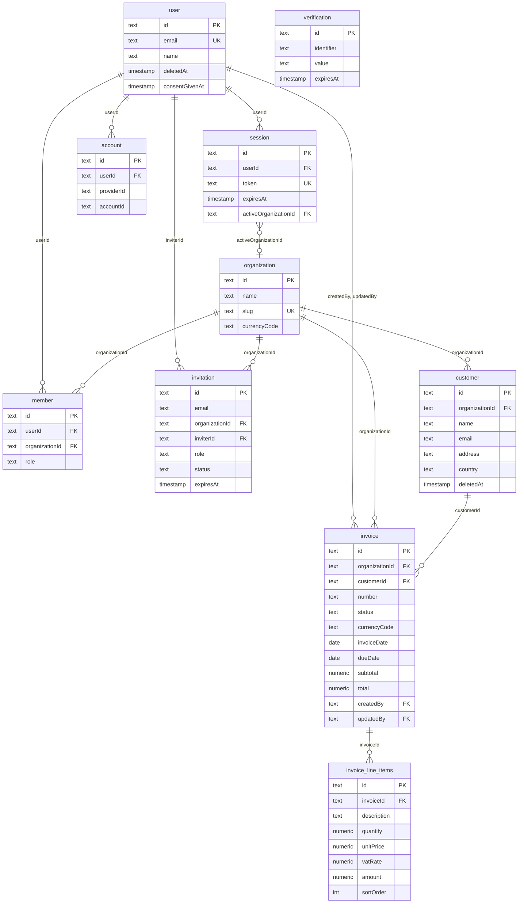

# SmartFaktura 1 – Database schema (app)

Aligned with [ARCHITECTURE.md](ARCHITECTURE.md) (Drizzle 0.45.x, PostgreSQL 15+) and agreed scope (single user per company, free-form invoice lines, one currency per company). This document defines **only the app-owned schema**: customers, invoices, invoice_line_items (plus products and invoice_activity_log in the implementation). Auth and tenant identity (user, session, organization, member) are managed by better-auth; see [AUTH.md](AUTH.md).

**Related documents:** [ARCHITECTURE.md](ARCHITECTURE.md) (stack), [AUTH.md](AUTH.md) (tenant, session), [MILESTONES_MVP.md](MILESTONES_MVP.md) (scope).

**Local development:** To run the app locally you need a Postgres database and **`DATABASE_URL`** set in `apps/backend/.env.development`. From the repo root: `bun run db:migrate` to apply migrations, and optionally `bun run db:studio` to open Drizzle Studio. See the root [README](../README.md) and [apps/backend/README](../apps/backend/README.md) for full setup.

**Production:** The database is deployed on **Supabase**. Use the connection string from your Supabase project (Settings → Database) as `DATABASE_URL` for the backend (e.g. on Render). Run migrations via your deploy pipeline or manually against the Supabase Postgres instance.

---

## 1. Overview

- **Tenant:** Each app row is scoped by `organizationId`. The current tenant is taken from the session (`session.activeOrganizationId`). All app queries must filter by this value; see [auth.md](auth.md).
- **IDs:** Text (cuid or uuid) for PKs and FKs, same as better-auth.
- **App tables:** customers, invoices, invoice_line_items (defined in detail below).
- **Auth tables:** user, session, account, verification, organization, member, invitation — managed by better-auth; schema generated by CLI. See [auth.md](auth.md). Shown in the diagram for context; we do not define their columns here.

---

## 2. App tables (Drizzle)

### 2.1 customers

| Column | Type | Constraints |
|--------|------|--------------|
| id | text | PK |
| organizationId | text | NOT NULL, FK → organization.id |
| name | text | NOT NULL |
| email | text | NOT NULL |
| address | text | NOT NULL (single line) |
| country | text | NOT NULL |
| createdAt | timestamp | NOT NULL, default now() |
| updatedAt | timestamp | NOT NULL, default now() |
| deletedAt | timestamp | nullable (soft delete; list/get filter WHERE deletedAt IS NULL) |

**Indexes:** (id), (organizationId), (organizationId, email) optional unique per tenant, (deletedAt) for filtering active customers.

---

### 2.2 invoices

| Column | Type | Constraints |
|--------|------|--------------|
| id | text | PK |
| organizationId | text | NOT NULL, FK → organization.id |
| customerId | text | nullable, FK → customers.id |
| number | text | NOT NULL (sequential per org: INV-001, INV-002) |
| status | text | NOT NULL, enum: 'draft' \| 'sent' \| 'paid' |
| currencyCode | text | NOT NULL, default 'NOK' |
| invoiceDate | date | NOT NULL |
| dueDate | date | nullable |
| subtotal | numeric | NOT NULL |
| total | numeric | NOT NULL |
| createdAt | timestamp | NOT NULL, default now() |
| updatedAt | timestamp | NOT NULL, default now() |
| createdBy | text | nullable, FK → user.id (audit) |
| updatedBy | text | nullable, FK → user.id (audit) |

**Indexes:** (id), (organizationId), (organizationId, status), (organizationId, number) **UNIQUE**, (customerId), (organizationId, invoiceDate) optional.

---

### 2.3 invoice_line_items

| Column | Type | Constraints |
|--------|------|--------------|
| id | text | PK |
| invoiceId | text | NOT NULL, FK → invoices.id ON DELETE CASCADE |
| description | text | NOT NULL |
| quantity | numeric | NOT NULL |
| unitPrice | numeric | NOT NULL |
| vatRate | numeric | nullable (manual VAT per line) |
| amount | numeric | NOT NULL (line total) |
| sortOrder | integer | nullable (display order) |

**Indexes:** (id), (invoiceId).

---

## 3. Entity-relationship (full schema)

Auth tables (user, session, account, verification, organization, member, invitation) are managed by better-auth. App tables (customers, invoices, invoice_line_items) are ours. All live in the same database.

---

## 4. Relationships

### Auth layer (better-auth)

| From | To | FK |
|------|-----|-----|
| session | user | session.userId → user.id |
| session | organization | session.activeOrganizationId → organization.id |
| account | user | account.userId → user.id |
| member | user | member.userId → user.id |
| member | organization | member.organizationId → organization.id |
| invitation | user | invitation.inviterId → user.id |
| invitation | organization | invitation.organizationId → organization.id |

### App layer + links to auth

| From | To | FK |
|------|-----|-----|
| customer | organization | customer.organizationId → organization.id |
| invoice | organization | invoice.organizationId → organization.id |
| invoice | customer | invoice.customerId → customer.id |
| invoice | user (audit) | invoice.createdBy, updatedBy → user.id |
| invoice_line_items | invoice | invoice_line_items.invoiceId → invoice.id |

---

## 5. Indexes (app tables)

This is the full MVP index set. Schema and migrations implement this from the start; no indexes are deferred.

| Table | Index | Type | Purpose |
|-------|--------|------|---------|
| customers | (id) | PK | Primary key |
| customers | (organizationId) | Index | Tenant isolation, list |
| customers | (organizationId, email) | UNIQUE | Unique email per tenant |
| customers | (deletedAt) | Index | Filter active customers (WHERE deletedAt IS NULL) |
| invoices | (id) | PK | Primary key |
| invoices | (organizationId) | Index | Tenant isolation, list |
| invoices | (organizationId, status) | Index | Filter by status (draft / sent / paid) |
| invoices | (organizationId, number) | UNIQUE | Sequential number per org |
| invoices | (customerId) | Index | List invoices by customer |
| invoices | (organizationId, invoiceDate) | Index | Date range filter |
| invoice_line_items | (id) | PK | Primary key |
| invoice_line_items | (invoiceId) | Index | List lines per invoice |

---

## 6. Constraints

Full MVP set. Indexes and app tables are in schema/migrations from the start; FKs to auth tables are added once better-auth schema exists (Week 2).

- **Tenant isolation:** Resolve `session.activeOrganizationId` for every request; filter customers and invoices by `organizationId`. Reject if no active org.
- **Soft delete (customers):** List and get filter `WHERE deletedAt IS NULL` unless loading deleted (e.g. export). No extra schema for export/delete-account.
- **Uniques:** (organizationId, number) on invoices; (organizationId, email) on customers.
- **FKs and ON DELETE (when auth exists):** invoice_line_items.invoiceId → invoices.id ON DELETE CASCADE; invoice.customerId → customers.id (restrict or set null); invoice.organizationId → organization.id; invoice.createdBy/updatedBy → user.id; customers.organizationId → organization.id.

---

## 7. Future considerations

- Invoice status: add `'cancelled'` and transitions when required.
- Company PDF: add organization fields (address, vatNumber, etc.) via auth layer when needed.
- Product catalog: optional product table and productId on line items later; free-form lines remain.
- Currency: one per org today; per-invoice override later if needed.

---

## 8. Scaling

Schema is designed to grow without breaking changes: tenant isolation by `organizationId` is consistent; soft delete and audit columns are in place; FKs reference auth-layer tables by id. New app tables follow the same pattern (organizationId, indexes, constraints). Org-level settings stay on the organization table (auth layer) via additionalFields.
